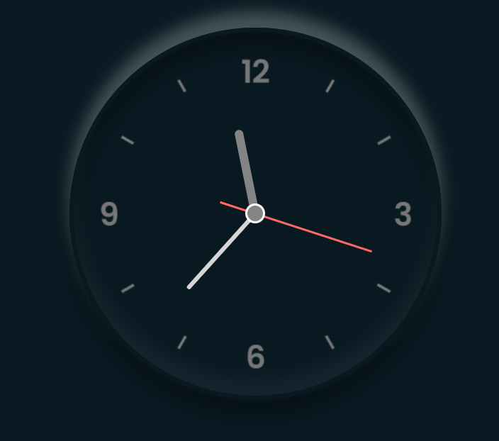

## Analog Clock Project

🕒 **Created By Mustafa**

This project features a simple, elegant analog clock implemented using HTML, CSS, and JavaScript.

### 📂 Project Structure

- **index.html**: The main HTML file that contains the structure of the analog clock and links to the CSS and JavaScript files.
- **style.css**: The CSS file that styles the clock and positions the elements on the page.
- **script.js**: The JavaScript file that powers the clock by setting the rotations of the hour, minute, and second hands.

### 🌟 Features

- **Analog Clock Design**: A visually appealing analog clock with hour, minute, and second hands.
- **Real-time Updates**: The clock updates every second to reflect the current time.
- **Responsive Layout**: The clock is centered on the page and adjusts to different screen sizes.

### 🚀 Getting Started

To run this project locally, follow these steps:

1. **Clone the Repository**: Download the project files to your local machine.
    ```sh
    git clone https://github.com/MustafaPinjari/analog-clock.git
    ```

2. **Navigate to the Project Directory**:
    ```sh
    cd analog-clock
    ```

3. **Open index.html in Your Browser**: 
    Simply open the `index.html` file in your preferred web browser to see the clock in action.

### 📄 File Descriptions

- **index.html**: 
  - Contains the HTML structure for the analog clock.
  - Links to the CSS and JavaScript files.

- **style.css**: 
  - Styles the body, heading, and clock elements.
  - Positions the clock hands using absolute positioning.
  - Applies a background image to the clock face.

- **script.js**: 
  - Uses JavaScript to rotate the clock hands based on the current time.
  - Sets an interval to update the hands every second.

### 🎨 Styling

The `style.css` file includes styles to:

- Center the clock on the page.
- Apply a background image to the clock face.
- Style the clock hands and position them correctly.

### 🛠️ Functionality

The `script.js` file contains the logic to:

- Get the current time using JavaScript's `Date` object.
- Calculate the rotation angles for the hour, minute, and second hands.
- Apply the rotations using CSS transforms.

### 🖼️ Screenshot



### 📞 Contact

If you have any questions or feedback, feel free to reach out to Mustafa at [unlessuser99@gmail.com.com].

---

Enjoy your new analog clock! ⏰