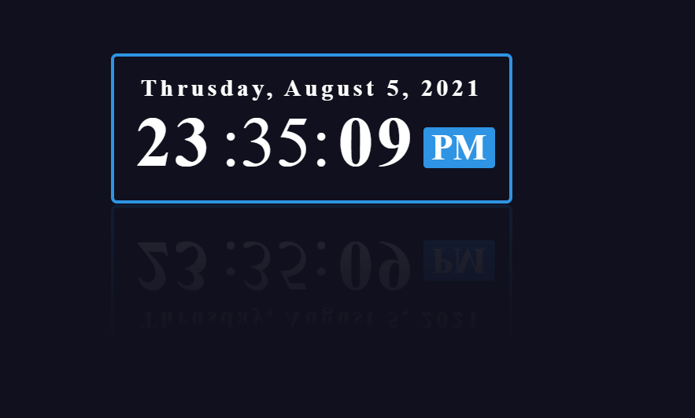

# Digital Clock Project

🎉 Welcome to the Digital Clock Project! 🎉

This project is a simple yet elegant digital clock that displays the current date and time with a sleek user interface. It updates in real-time and adds a touch of modernity to your web page. This README file will guide you through the project setup and provide an overview of the code structure.

## Project Overview

The Digital Clock Project consists of three main files:
1. `index.html` - The HTML file that structures the web page.
2. `style.css` - The CSS file that styles the digital clock.
3. `script.js` - The JavaScript file that updates the clock in real-time.

### Screenshot



## Features

- 📅 **Date Display**: Shows the current day, month, date, and year.
- ⏰ **Time Display**: Displays hours, minutes, seconds, and the AM/PM period.
- ✨ **Stylish Design**: Features a modern and responsive design with interactive hover effects.

## Setup Instructions

### 1. Clone the Repository

First, clone the repository to your local machine using the following command:
```bash
git clone https://github.com/MustafaPinjari/digital-clock.git
```

### 2. Navigate to the Project Directory

```bash
cd digital-clock
```

### 3. Open `index.html`

Open the `index.html` file in your preferred web browser to view the digital clock.

## File Descriptions

### `index.html`

The `index.html` file contains the basic structure of the web page. It links the CSS file for styling and the JavaScript file for the clock functionality.

### `style.css`

The `style.css` file styles the digital clock, providing it with a modern look and feel. It includes styles for the date and time display, as well as hover effects to enhance user interaction.

### `script.js`

The `script.js` file contains the JavaScript code responsible for updating the clock in real-time. It fetches the current date and time, formats it appropriately, and updates the DOM elements accordingly.

## How It Works

1. **HTML Structure**: The HTML file defines the structure of the clock, including elements for the date and time.
2. **CSS Styling**: The CSS file styles these elements, positioning them in the center of the screen and adding visual enhancements.
3. **JavaScript Functionality**: The JavaScript file uses the `Date` object to get the current date and time, formats the values, and updates the HTML elements every second.

## Contributions

Contributions are welcome! If you have any suggestions or improvements, feel free to open an issue or submit a pull request.

## License

This project is licensed under the MIT License. See the [LICENSE](LICENSE) file for details.

## Contact

If you have any questions or feedback, please reach out to [Mustafa Pinjari](mailto:unlessuser99@gmail.com).

---

Thank you for checking out the Digital Clock Project! We hope you find it useful and informative. Happy coding! 🚀