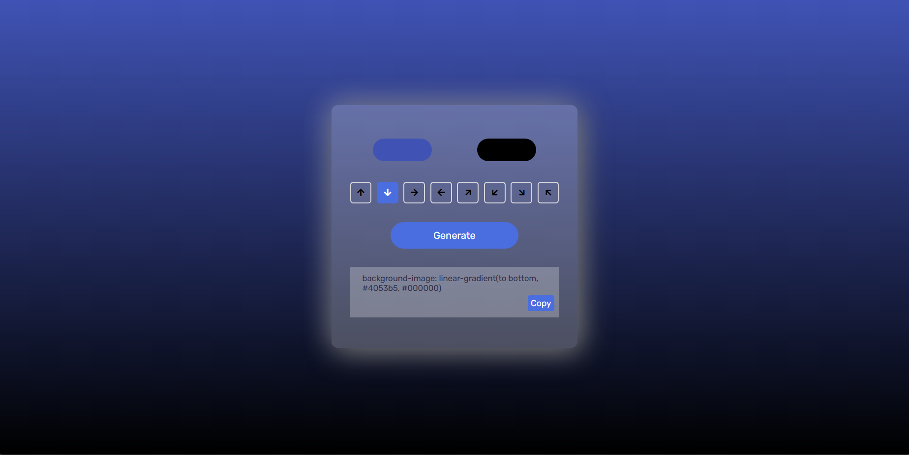

# Gradient Generator

Welcome to the Gradient Generator project! This simple and intuitive web application allows users to create and customize CSS linear gradients. The user-friendly interface enables you to select colors and gradient directions, and it generates the corresponding CSS code, which you can easily copy and use in your projects.

## 🌟 Features

- 🎨 **Color Picker**: Select two colors for the gradient.
- ⬆️⬇️⬅️➡️ **Direction Buttons**: Choose the direction of the gradient (top, bottom, left, right, and diagonals).
- 🛠️ **Generate Button**: Creates the CSS code for the selected gradient.
- 📋 **Copy Button**: Easily copy the generated CSS code to your clipboard.

## 🎥 Demo

 

## 🛠️ Installation

To get a local copy up and running, follow these simple steps:

### 📋 Prerequisites

Ensure you have a modern web browser installed.

### 📥 Clone the Repository

Clone the repository to your local machine.

### 🚀 Open the Project

1. Navigate to the project directory.
2. Open `index.html` in your preferred web browser.

## 📚 Usage

1. **Select Colors**: Use the color pickers to choose your desired colors.
2. **Set Direction**: Click on the buttons to set the gradient direction.
3. **Generate Code**: Click the "Generate" button to create the CSS code.
4. **Copy Code**: Click the "Copy" button to copy the generated CSS code to your clipboard.

## 🤝 Contributing

Contributions are what make the open-source community such an amazing place to learn, inspire, and create. Any contributions you make are **greatly appreciated**.

## 📜 License

Distributed under the MIT License. See `LICENSE` for more information.

## 📞 Contact

- **Mustafa Pinjari**
  - [LinkedIn](https://www.linkedin.com/in/mustafa-pinjari-287625256/)
  - [GitHub](https://github.com/MustafaPinjari)
  - [Instagram](https://www.instagram.com/its_ur_musuuu)
  - Email: unlessuser99@gmail.com

Thank you for checking out the Gradient Generator project! Happy coding! 🎉