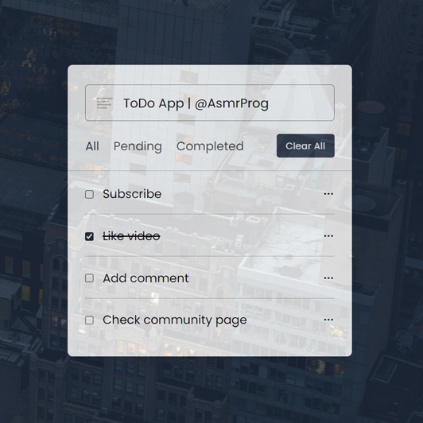

# 📋 ToDo App

Welcome to the ToDo App project! This app is a simple and efficient way to manage your tasks. Below you will find all the necessary information to get started and make the most out of this app.

## ✨ Features

- **Add Tasks**: Quickly add new tasks to your to-do list.
- **Filter Tasks**: View all tasks, only pending tasks, or only completed tasks.
- **Edit Tasks**: Easily update task names.
- **Delete Tasks**: Remove tasks that are no longer needed.
- **Clear All Tasks**: Clear your entire list in one go.
- **Persistent Storage**: Your tasks are saved in the local storage, so they persist even after refreshing the page.

## 🛠️ Installation

1. **Clone the Repository**
   ```bash
   git clone https://github.com/yourusername/todo-app.git
   ```
2. **Navigate to the Project Directory**
   ```bash
   cd todo-app
   ```
3. **Open `index.html` in Your Browser**

## 📄 Structure

- **index.html**: The main HTML file.
- **style.css**: The CSS file for styling.
- **index.js**: The JavaScript file containing the app logic.

## 🚀 Usage

1. **Add a Task**: Type in your task in the input field and press Enter.
2. **Filter Tasks**: Click on "All", "Pending", or "Completed" to filter tasks.
3. **Edit a Task**: Click the edit icon next to the task, update the task name in the input field, and press Enter.
4. **Delete a Task**: Click the delete icon next to the task you wish to remove.
5. **Clear All Tasks**: Click the "Clear All" button to remove all tasks from the list.

## 🌟 Example

Imagine you have a list of tasks:
- Buy groceries 🛒
- Finish homework 📚
- Call mom 📞

You can easily manage this list using the ToDo App by adding these tasks, marking them as completed when done, editing if needed, and clearing them when they are no longer relevant.

## 📷 Screenshots




## 🧑‍💻 Author

[](https://www.linkedin.com/in/mustafa-pinjari-287625256/)
[](https://github.com/MustafaPinjari)
[](https://www.instagram.com/its_ur_musuuu)
[](mailto:unlessuser99@gmail.com)

## 📄 License

This project is licensed under the MIT License - see the [LICENSE](LICENSE) file for details.

## 🙌 Acknowledgments

- Icon library by [Unicons](https://iconscout.com/unicons)

Happy task managing! 🎉