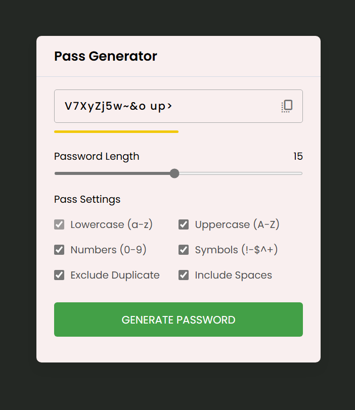

# Password Generator 🚀

Welcome to the Password Generator project! This project helps you create strong, customizable passwords with ease. 🛡️

## Features ✨

- **Password Length Adjustment**: Easily set your desired password length. 📏
- **Character Options**: Choose to include lowercase, uppercase, numbers, and symbols. 🔠🔢🔣
- **Exclude Duplicates**: Option to exclude duplicate characters in your password. 🔄
- **Include Spaces**: Add spaces to your password if desired. 🆓
- **Real-time Strength Indicator**: Visual feedback on password strength (weak, medium, strong). 💪

## Getting Started 🚀

1. **Clone the repository**:
   ```bash
   git clone https://github.com/MustafaPinjari/password-generator.git
   ```
2. **Navigate to the project directory**:
   ```bash
   cd password-generator
   ```
3. **Open `index.html` in your browser**:
   ```bash
   open index.html
   ```

## Usage 📚

1. **Set Password Length**: Use the slider to adjust the password length.
2. **Select Options**: Check the boxes for lowercase, uppercase, numbers, symbols, exclude duplicates, and include spaces.
3. **Generate Password**: Click the "Generate Password" button to create your password.
4. **Copy Password**: Click the copy icon to copy your generated password to the clipboard.

## Technologies Used 🛠️

- **HTML5**: Structure and layout
- **CSS3**: Styling and design
- **JavaScript**: Functionality and interactivity

## Screenshots 📸



## Contributing 🤝

Contributions are welcome! Please open an issue or submit a pull request. For major changes, please discuss them first to ensure they fit the project's direction.

## License 📜

This project is licensed under the MIT License. See the `LICENSE` file for details.

## Acknowledgments 🙌

- Thanks to the creators of the libraries and tools used in this project.
- Special thanks to the contributors who helped improve this project.

---

Happy password generating! 🔒

---

For any questions or feedback, please feel free to contact me at [unlessuser99@gmail.com](mailto:unlessuser99@gmail.com).

---

**Note**: Always remember to keep your passwords safe and secure. Never share them publicly. 🚨