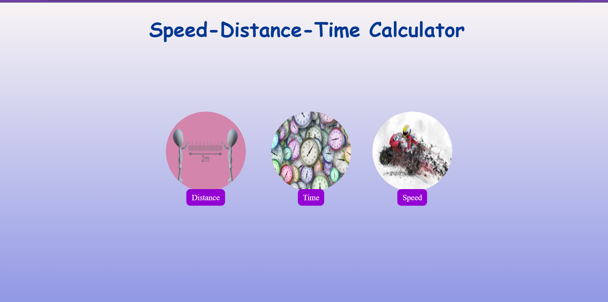
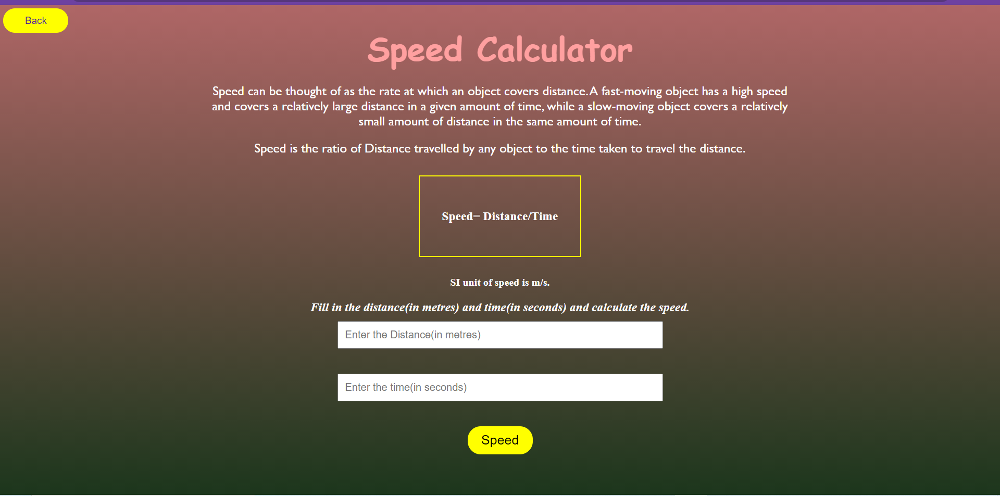
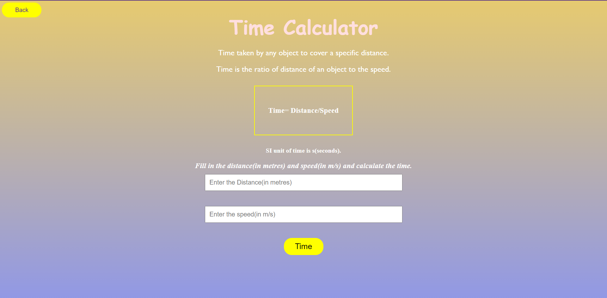
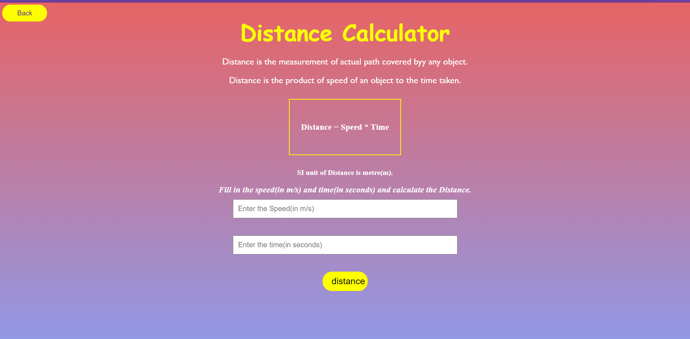

## Project Overview

The **Speed-Distance-Time Calculator** is a simple web-based application designed to help users calculate the speed, distance, or time based on the input values of the other two variables. This project is ideal for educational purposes, providing a clear demonstration of basic kinematic equations and their applications.


## Default view of the website
HOMEPAGE


Speed Calculator


Time Calculator


Distance Calculator

# Speed-Distance-Time Calculator


## Features

- **Home Page**: A central hub with links to the three main calculators (Speed, Distance, and Time).
- **Speed Calculator**: Computes the speed of an object when the distance traveled and the time taken are provided.
- **Distance Calculator**: Computes the distance traveled by an object given its speed and the time taken.
- **Time Calculator**: Computes the time taken for an object to travel a given distance at a specified speed.

## Technologies Used

- **HTML5**: For structuring the content on the web pages.
- **CSS3**: For styling the application and making it visually appealing.
- **JavaScript**: For the interactive calculations on the client side.

## Project Structure

- **index.html**: The homepage with links to the individual calculators.
- **CalcDistance.html**: Page dedicated to the Distance Calculator.
- **CalcSpeed.html**: Page dedicated to the Speed Calculator.
- **CalcTime.html**: Page dedicated to the Time Calculator.
- **style.css**: The CSS file containing all the styling for the application.
- **images/**: Directory containing the images used in the application.

## Usage

1. **Home Page**: Start by visiting the home page where you can navigate to any of the calculators.
2. **Calculate Speed**: Go to the Speed Calculator, enter the distance in meters and time in seconds, and click the calculate button to see the speed.
3. **Calculate Distance**: Go to the Distance Calculator, enter the speed in meters per second and time in seconds, and click the calculate button to see the distance.
4. **Calculate Time**: Go to the Time Calculator, enter the distance in meters and speed in meters per second, and click the calculate button to see the time.

## Installation

To run the project locally, follow these steps:

1. Clone the repository to your local machine.
    ```bash
    git clone https://github.com/MustafaPinjari/speed-distance-time-calculator.git
    ```
2. Navigate to the project directory.
    ```bash
    cd speed-distance-time-calculator
    ```
3. Open the `index.html` file in your web browser.

## Contributions

Contributions to this project are welcome. Feel free to submit issues and pull requests to enhance the functionality or design of the application.

## License

This project is licensed under the MIT License. You are free to use, modify, and distribute this software as per the terms of the license.

## Acknowledgments

- Special thanks to the developers who contributed to the various libraries and tools used in this project.
- Thanks to all the users who provided valuable feedback and suggestions for improving this application.

## Contact

For any inquiries or feedback, please reach out via:
- **Email**: unlessuser99@gmail.com
- **GitHub**: [Mustafa Pinjari](https://github.com/MustafaPinjari)

Thank you for using the Speed-Distance-Time Calculator!