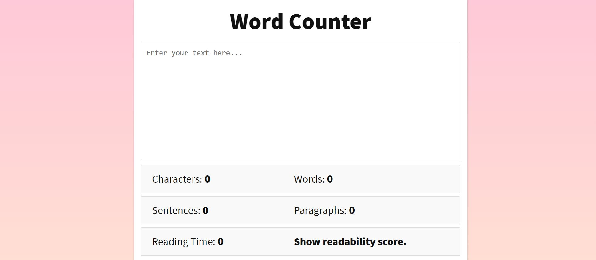

# Word Counter Project

## Project Description

The Word Counter project is a web-based application built using HTML, CSS, and JavaScript. It provides a simple and intuitive interface to count the number of characters, words, sentences, and paragraphs in a given text. Additionally, it estimates the reading time, calculates readability scores, and generates a list of top keywords from the input text. This project can be useful for writers, editors, and anyone who needs to analyze the text content.

## Features

- **Character Count**: Displays the total number of characters in the input text.
- **Word Count**: Counts and displays the number of words.
- **Sentence Count**: Calculates and shows the number of sentences.
- **Paragraph Count**: Counts the number of paragraphs.
- **Reading Time**: Estimates the time required to read the text based on a standard reading speed.
- **Readability Score**: Fetches and displays the readability score using the Flesch Reading Ease formula.
- **Top Keywords**: Identifies and lists the most frequently used keywords in the text.

## Installation

1. **Clone the Repository**: 
   ```bash
   git clone https://github.com/MustafaPinjari/word-counter.git
   ```
2. **Navigate to the Project Directory**:
   ```bash
   cd word-counter
   ```

## Usage

1. **Open `index.html`**:
   Simply open the `index.html` file in a web browser to start using the Word Counter.

2. **Enter Text**:
   - Enter or paste your text into the textarea provided.
   - The application will automatically update the character, word, sentence, and paragraph counts as you type.

3. **Check Readability**:
   - Click on the "Show readability score" to fetch and display the readability score of the text.
   - The readability score will indicate the grade level required to comprehend the text.

4. **View Top Keywords**:
   - The most frequently used keywords in the text will be displayed at the bottom.

## File Overview

- **index.html**: The main HTML file containing the structure of the web page.
- **word.css**: The CSS file that styles the web page.
- **word.js**: The JavaScript file that contains the logic for counting characters, words, sentences, paragraphs, calculating reading time, fetching readability scores, and identifying top keywords.

## Example

Here is an example of how the Word Counter application looks and functions:

1. **User Interface**: 
   - The interface includes a large textarea for text input and sections that display the character count, word count, sentence count, paragraph count, reading time, readability score, and top keywords.

2. **Real-time Updates**:
   - As you type in the textarea, the application updates the statistics in real-time, providing immediate feedback on the text's properties.

3. **Readability Score**:
   - By clicking on the "Show readability score" button, you can fetch the readability score, which helps in understanding the complexity of the text.

## Technologies Used

- **HTML**: For structuring the web page.
- **CSS**: For styling the web page.
- **JavaScript**: For implementing the core functionality of the word counter.

## Contributing

Contributions are welcome! If you have any suggestions or improvements, feel free to submit a pull request or open an issue on GitHub.

## License

This project is licensed under the MIT License. See the LICENSE file for more details.

---

This README file provides a comprehensive overview of the Word Counter project, including its features, installation, usage, and file structure. It aims to help users understand how to use the application and how it functions.

